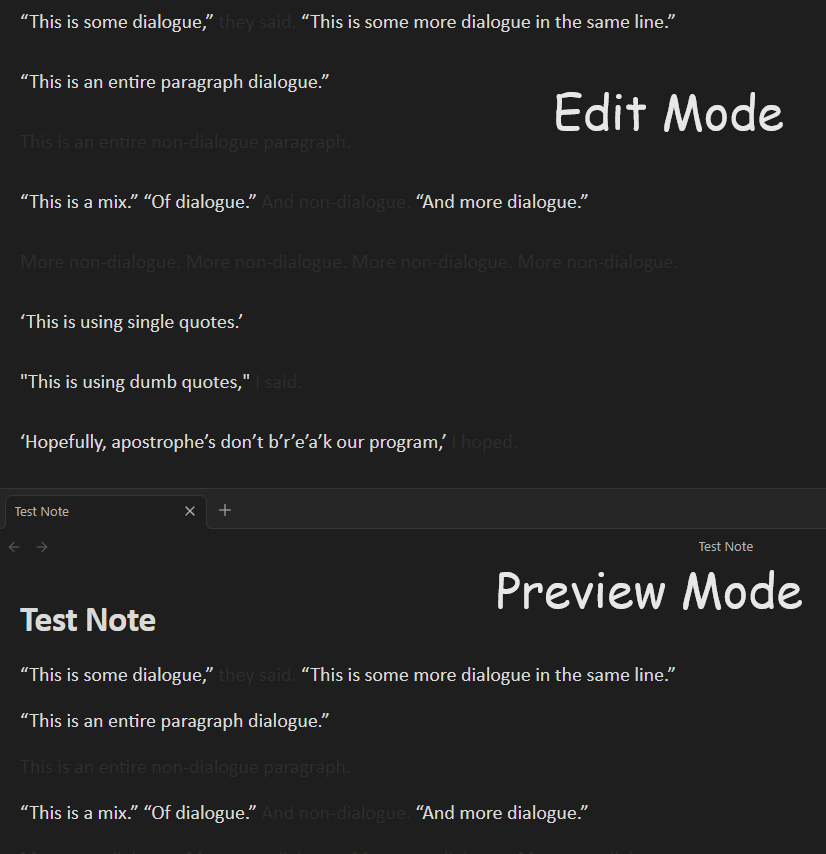

# Obsidian Dialogue Mode

Obsidian Dialogue Mode is a plugin designed to enhance your writing experience in Obsidian by fading out non-dialogue text, making it easier to focus on the most relevant parts of your writing.

## Usage

Dialogue mode is enabled by default.

**Toggle Dialog Mode**: Use the command palette (Ctrl+P or Cmd+P) and search for "Toggle dialogue mode" to enable or disable the fade-out effect.

**Customizable Fade Intensity**: Adjust the fade intensity in the settings tab.

## Installing

1. **Install the Plugin**:
   - (Recommended) If installing through Obsidian, go to Settings > Community plugins > Browse and search for "Dialogue Mode".
   - If downloading manually, place the plugin files in your Obsidian plugins folder.
2. **Enable the Plugin**: Go to Settings > Community plugins, find "Dialogue Mode" and toggle it on.
3. **Configure Settings**: Adjust the plugin settings to your preference by navigating to Settings > Dialogue Mode Settings.

## Advanced Customization

For theming, the faded out color (at max intensity) can be changed via this CSS variable: 

`--dialogue-excluded-text-color`

## Development

If you want to contribute or modify the plugin, follow these steps:

- Clone this repo.
- Make sure your NodeJS is at least v16 (`node --version`).
- `npm i` or `yarn` to install dependencies.
- `npm run dev` to start compilation in watch mode.
- Feel free to file a pull request with any improvements.
